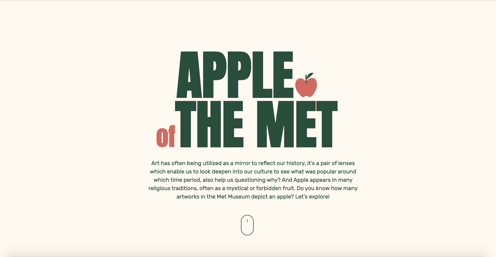
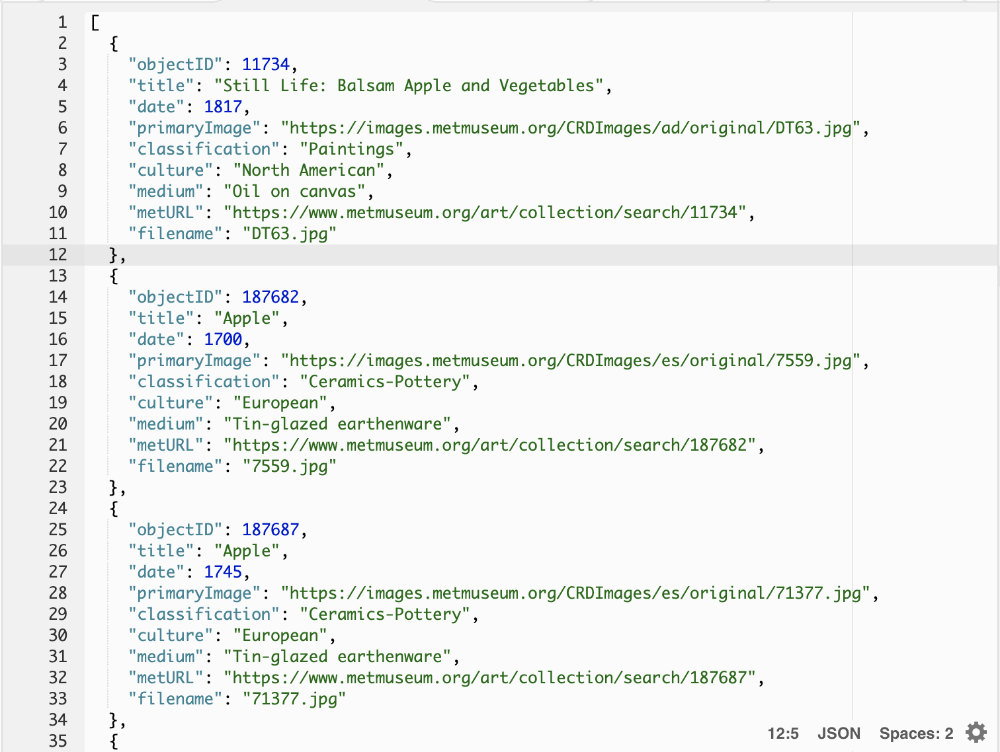
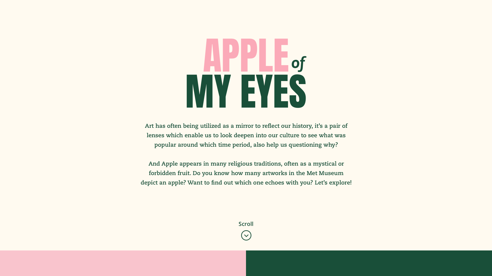
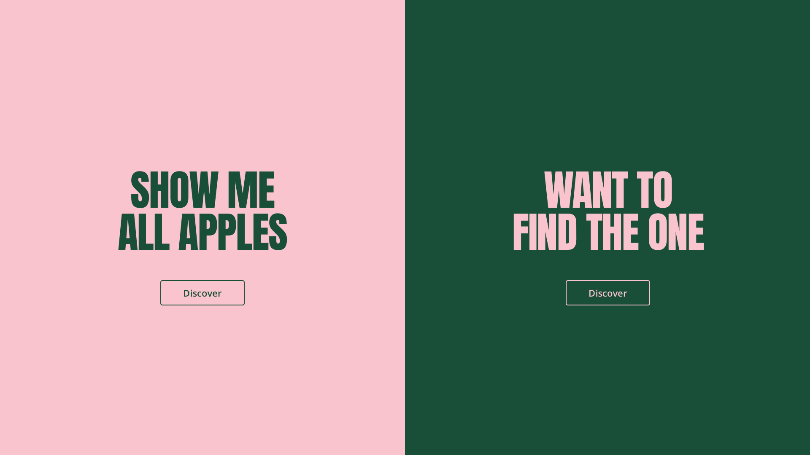
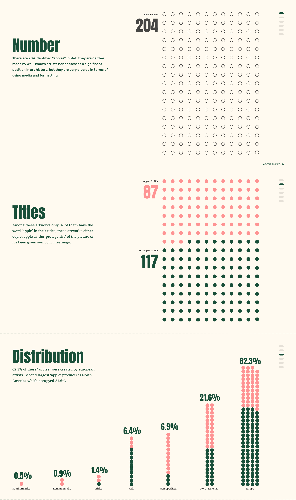
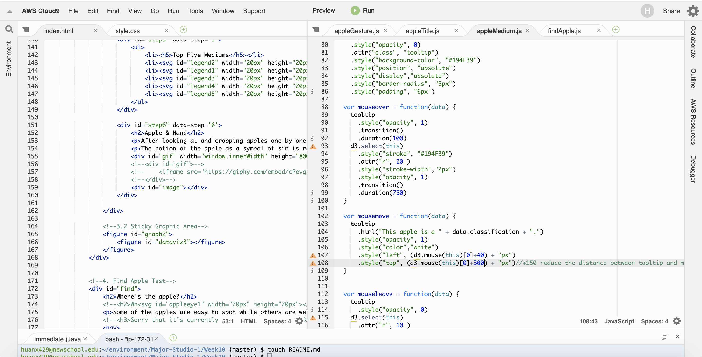

# Apple of The Met

[click to view details](https://xingwei726.github.io/Major-Studio-1/Week10_InteractiveProject/test8/)

## Project Introduction:

As an interactive counter piece for the [Apple of My Eyes](https://github.com/Xingwei726/Major-Studio-1/tree/master/Qualitative), this interactive data visualization provides audiences with a linear narrative journey. "Scrolling is a continuation, clicking is a decision." Through this visualization audience can look closer and appreciate each apple which usually have been ignored from the frame. Also dive into different aspects of apples inside met collection to see which culture uses apple more frequently than the other.

## Inspiration
Art has often being utilized as a mirror to reflect our history, it’s a pair of lenses which enable us to look deepen into our culture to see what was popular around which time period, also help us questioning why? There are 205 identified “Apples” in Met, they are neither made by well-known artists nor possesses a significant position in art history, but they are very diverse in terms of using media and formatting. Were they being used to embody the symbolic meaning as well?

***About Apple:***
Apples appear in many religious traditions, often as a mystical or forbidden fruit.  ( In greek mythology, to throw an apple at someone was to symbolically declare one's love; and similarly, to catch it was to symbolically show one's acceptance of that love. ) Renaissance painters may also have been influenced by the story of the golden apples in the Garden of Hesperides. As a result, in the story of Adam and Eve, the apple became a symbol for knowledge, immortality, temptation, the fall of man into sin, and sin itself.

## Dataset:
Because for the last project I was mainly using the CSV file for all the apple data, I queried them again this time but stored in JSON format for easier access when it comes to design.

## Preliminary Sketch

## Coding Process
I've been stuck for weeks on the coding...it even took me a while to figure out how to code some simple functions. But I'm glad for being through this process, it helped me to better understand the 'pain' of my developer friends caused by designers. 

**Something to improve in the future:**
 - At first I put all my codes in one Javascript file ( because I had zero idea that multiple javascript files can coexist with each other ) as soon as I found out I can, I separated them into different files and that's so much easier for me to see the structure and adjust each part without interfering others.
 - I'm still not very familiar with the structure about one function nested inside one function which is nested another. Therefore I didn't connect my scrollable part with force layout coding, I tried but some errors popped up. Next time I will start with settling down the big functions first and insert small one in between.
 - Another thing I want to study more is about what to put in html and what to put in javascript file, what are advantages and disadvantages? Because with d3 we can insert svg shapes by javascript but we can also just write it inside html at the first place. Same with some of the other elements such as images and gifs.

## Final Design

[click to view details](https://xingwei726.github.io/Major-Studio-1/Week10_InteractiveProject/test8/)

## Self Critics
- In the first section, when user hover on an apple image, that image should be on top of others. I tried to use "z-index" value in the transformation but somehow it didn't work.
- The gif in hand gesture section has a black background, I tried many ways to get rid of it but still not working, in the end I put it inside a 'black' container in order to reduce the abruption of this color.
- In the last section, there is a loading time when user clicks on the number, should look more into that and see if there is any other approach to optimize the loading time. And if I have more time, I would add the hint to each image instead of using just one 'hint' for all.