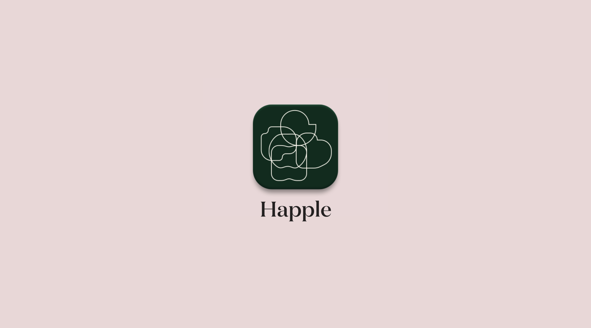
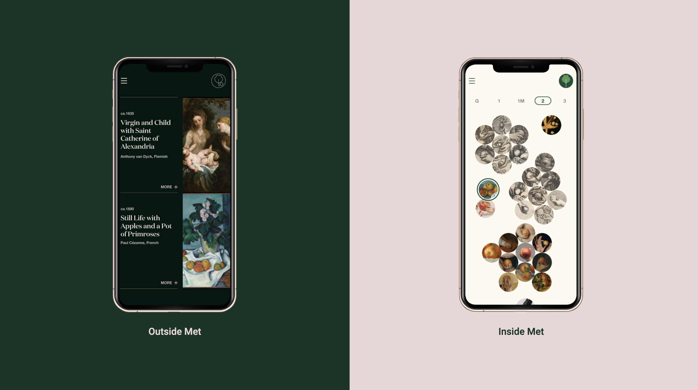
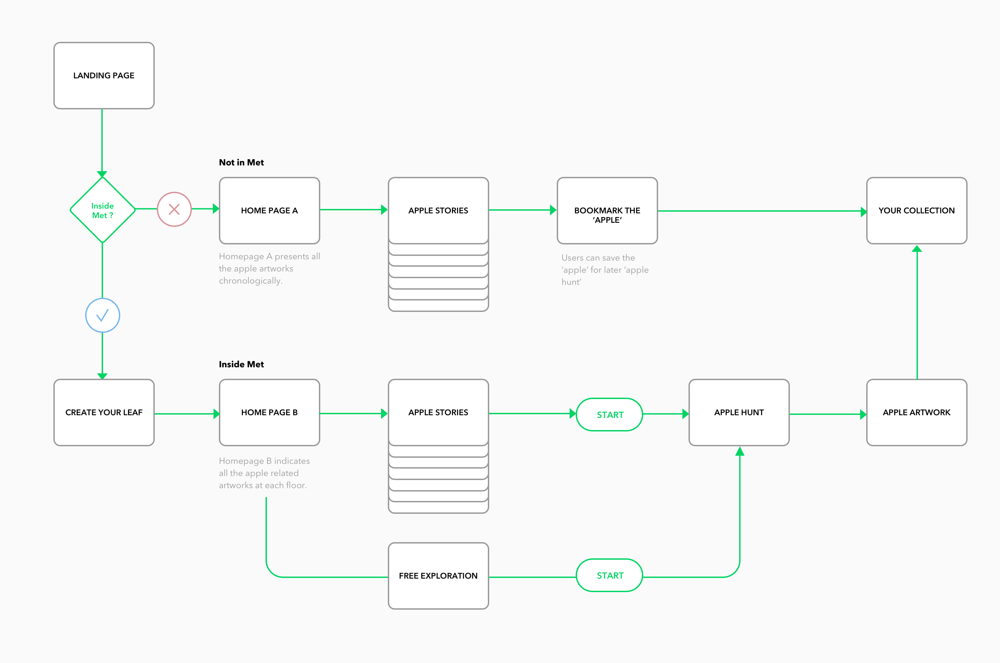
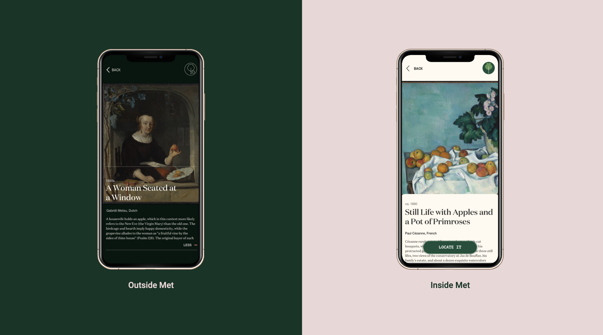
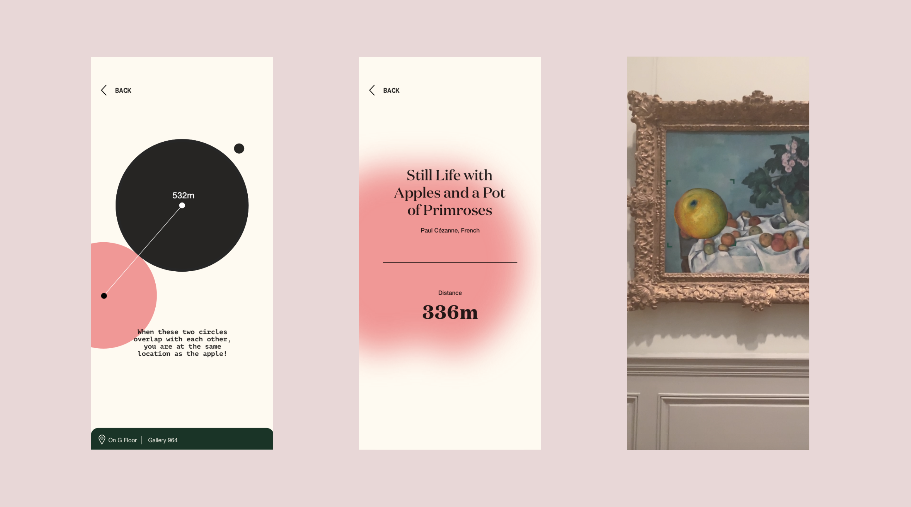
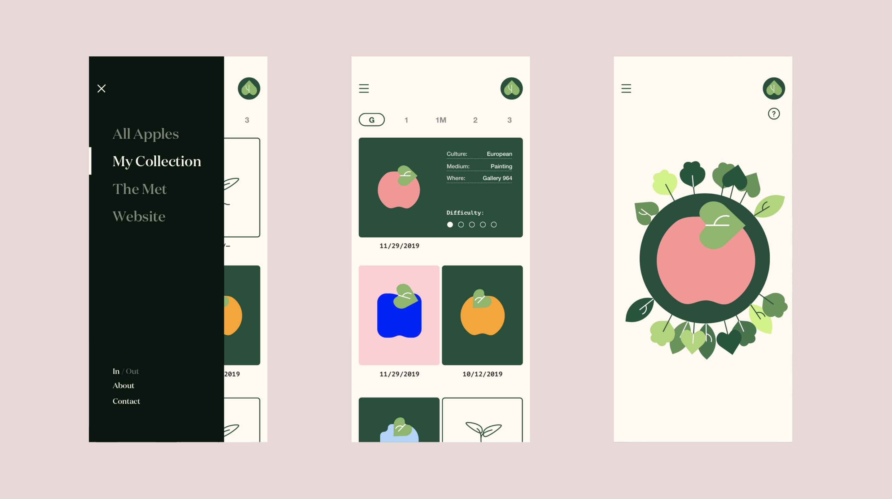

# Happle

## Project Introduction:

This mobile app concept is a further development of the [Apple of The Met](https://github.com/Xingwei726/Major-Studio-1/tree/master/Interactive), it works as the digital complement for the website. While previous website design presents users with a story about apple and redirect users to the online website. **This app helps visitors in the offline experience of navigating inside Met to find Apple.**

## Site Map

## Design
The app emphasizes at different parts of the content based on whether the user is currently **inside** or **outside** the Met Museum

Its purpose is to provide minimum guidances, not overtaken the fun of  ‘hunting’. 

Once you discovered an apple successfully, it will reveal the its apple icon and inside app you can see what’s the proportion of other people who discovered it as well.

## User Journery & Interaction
For user journery details please visit [here](https://vimeo.com/379307061)

