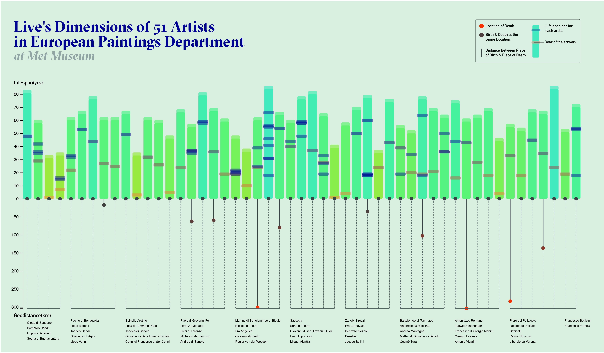
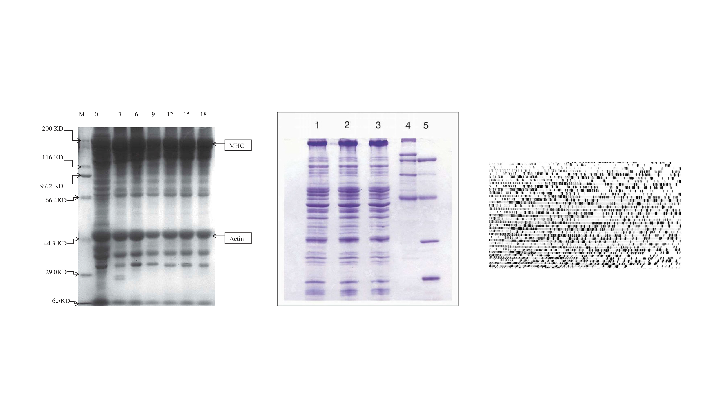
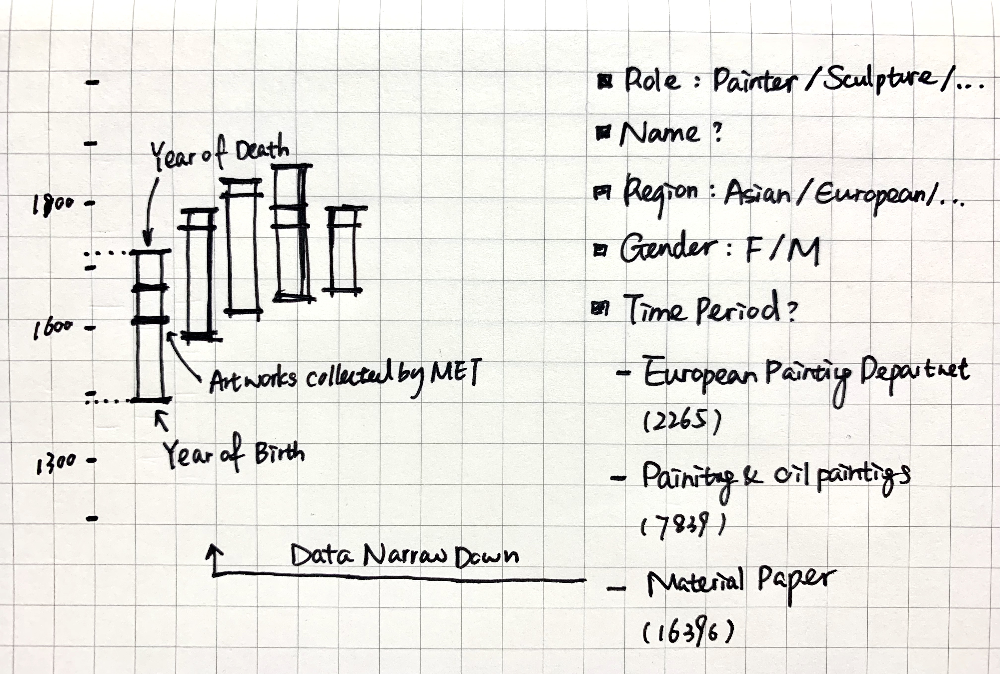
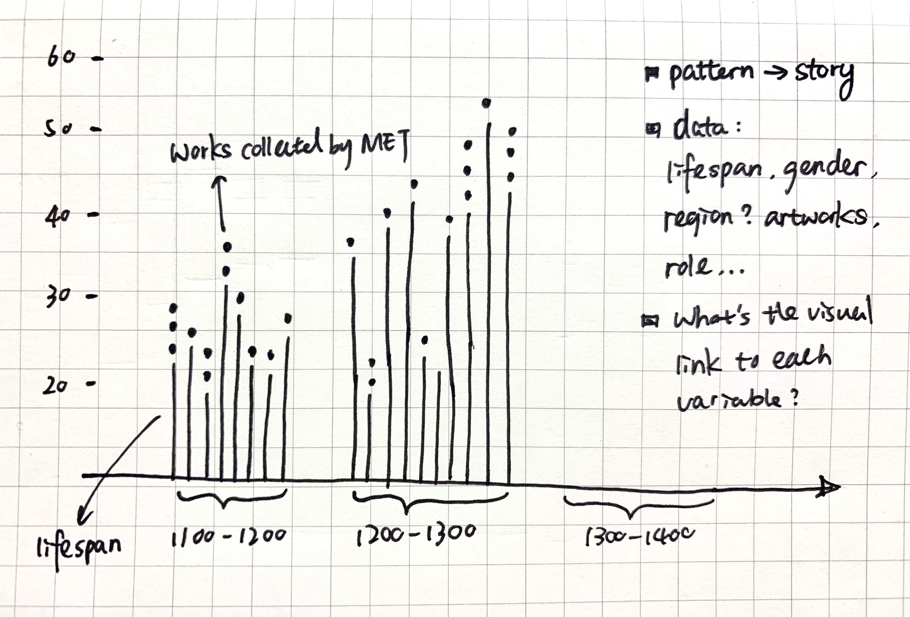
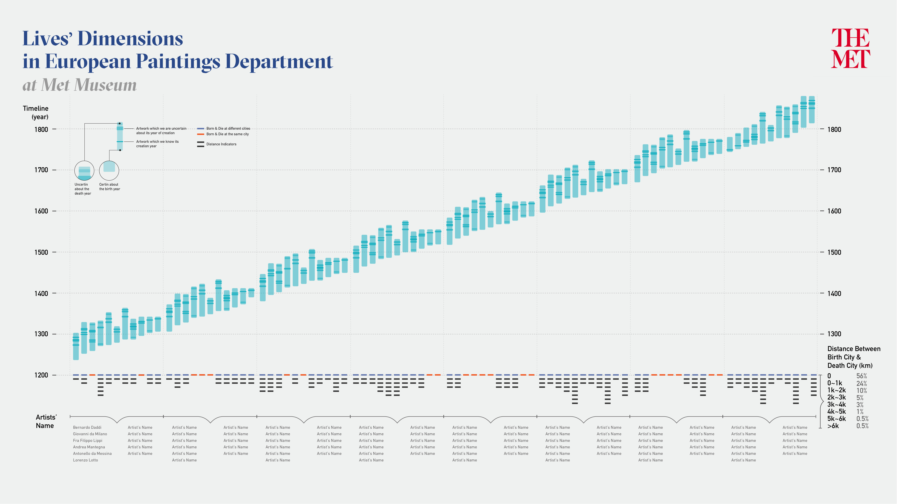
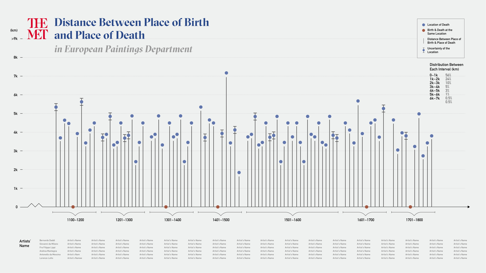
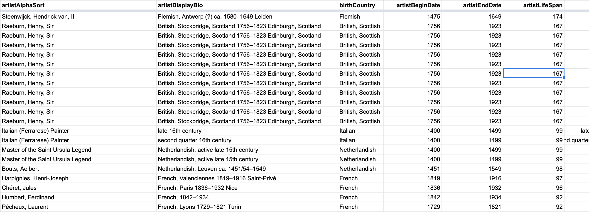
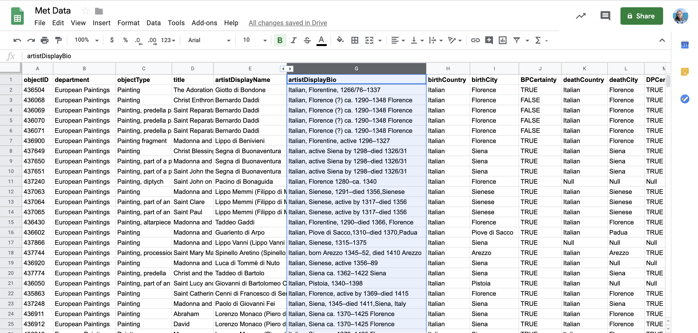
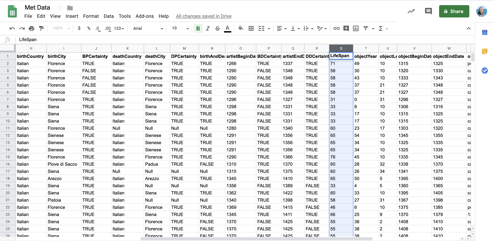
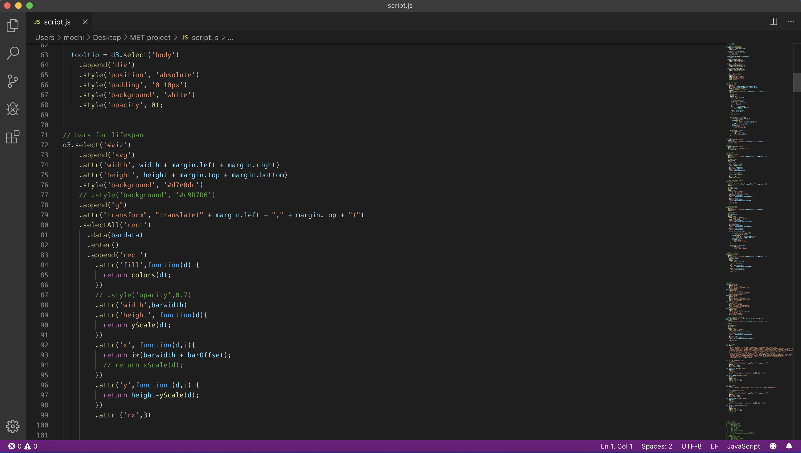

# Lives' Dimensions



## Project Introduction:

For this quantitative data project, I want to explore the pattern formed by measuring the 'lengths' of artists' lives. Two Lengths: Artists' Life Spans (yrs); Distance between artists' places of birth & places of death (km). This project aims to visualize their relationship from a relatively macro perspective.

## Dataset:
The dataset that's been used in this project is provided by the Metropolitan Museum of Art.

```javascript
  var currentID = objectData.objectID;
  var currentTitle = objectData.title;
  var currentDate = objectData.objectBeginDate;
  var endDate = objectData.objectEndDate;
  var artistName = objectData.artistDisplayName;
  var artistBeginDate = objectData.artistBeginDate;
  var artistEndDate = objectData.artistEndDate;
  var geoLocation = objectData.artistDisplayBio;
  var index = myArray.length;
  myArray[index] = {};
  myArray[index]["id"] = currentID;
  myArray[index]["title"] = currentTitle;
  myArray[index]["from"] = currentDate;
  myArray[index]["to"] = endDate;
  myArray[index]["name"]= artistName;
  myArray[index]["yearOfBirth"] = artistBeginDate;
  myArray[index]["yearOfDeath"] = artistEndDate;
  myArray[index]["distanceBetween"] = geoLocation;
```

**Things I want to show through this visualization:**

- General lifespan pattern among artists in European Paintings department at Met Museum
- Distance between artists' places of birth and places of death
- Frequencies at each interval
- Two lengths: ‘length’ in terms of lifespan years and ‘length’ in terms of geographical distance. Explore if there is a relationship between the distance and their lifespan.


**Primary Datasets:**

-   Lifespan = artistEndDate - artistBeginDate
-   Distance between birth and death = geoLocation of death - geolocation of birth
-   Timeline


**Secondary Datasets:**

-   Artists' Names

 
## Design References

If we compare the MET museum to a breathing organism, artists are similar to its DNA which carrying genetic instructions for function and growth. Inspiration of the visual forms came from Gel Electrophoresis, it is used as a diagnostic tool to visualize the fragments. Using electrophoresis, we can see how many different DNA fragments are present in a sample and how large they are relative to one another. Instead of imitating DNA shape, I took the abstract from and its transparency feature, applied with the MET data.

A well-defined  “line” of DNA on a gel is called a band. Each band contains a large number of DNA fragments of the same size that have all traveled as a group to the same position. In this visualization I adopted the  ‘band’ shape to mark each year of the artwork.

## Preliminary Sketch










## Design Process
During the process I discovered the uncertainty with artist's birthdate data, especially with those artists who are not well-known. So I went back to the CSV file downloaded through MET API and tried to gather the information about artist's birthdate from other resources.




After the data cleaning process, I used d3 to implement my design with this dataset.



## Final Design


For more process information please visit [here](https://github.com/Xingwei726/Major-Studio-1/blob/master/Week4_d3js_projects/final/Final%20Presentation_Xingwei%20Huang.pdf).
To view a [clip](https://github.com/Xingwei726/Major-Studio-1/blob/master/Week4_d3js_projects/final/Final%20Presentation.mov) of the interaction.


