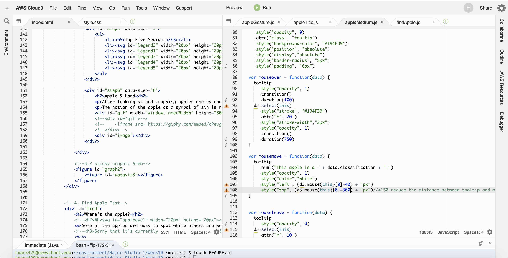

# “Apple of The Met” 

## Concept

As an interactive counter piece for the printed apple map, this interactive data visualization provides audiences with a linear narrative journey. "Scrolling is a continuation, clicking is a decision." Through this visualization audience can look closer and appreciate each apple which usually have been ignored from the frame. Also dive into different aspects of apples inside met collection to see which culture uses apple more frequently than the other 

## Inspiration & References
[Pudding(narrative)](https://pudding.cool/2017/03/hamilton/)
[Scrolling(narrative)](http://vallandingham.me/scroll_demo/)
[Trust(interactive)](https://ncase.me/trust/)

## Preliminary Sketches

## Data Sorting
Because for the last project I was mainly using the csv file for all the apple data, I queried them again this time but stored in JSON format for easier access when it comes to design. 

## Coding Process
I've been stuck for weeks on the coding...it even took me a while to figure out how to code some simple functions. But I'm glad for being through this process, it helped me to better understand the 'pain' of my developer friends caused by designers. 

**Something to improve in the future:**
 - At first I put all my codes in one Javascript file ( because I had zero idea that multiple javascript files can coexist with each other ) as long as I found out I can, I separated them into different files and that's so much easier for me to see the structure and adjust each part without interfering others.
 - I'm still not very familiar with the structure about one function nested inside one function which is nested another. Therefore I didn't connect my scrollable part with force layout coding, I tried but some errors popped up. Next time I will start with settling down the big functions first and insert small one in between.
 - Another thing I want to study more is about what to put in html and what to put in javascript file, what are advantages and disadvantages? Because with d3 we can insert svg shapes by javascript but we can also just write it inside html at the first place. Same with some of the other elements such as images and gifs.

## Final Design

[click to view details](https://xingwei726.github.io/Major-Studio-1/Week10/test8/)