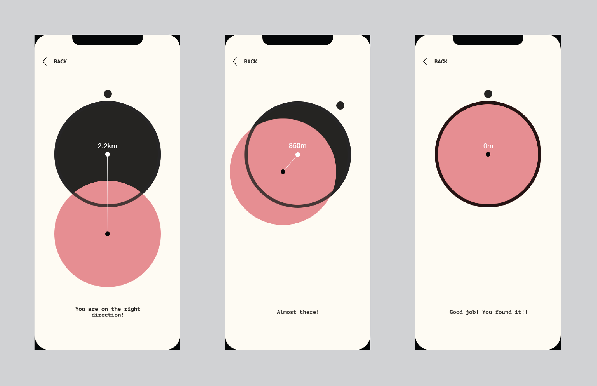

## Concept 1 & 1.5 Leaf Marks

I noticed that after visitors exist the MET, they either keep the sticker as a souvenir or left it on a white board, I thought about that’s a dataset we can utilize as well. Because those stickers are representations of connection between visitors and the museum collections. If we give them a sticker that represent their identity (for now I only have some basic definitions: Where you from? Age? Gender?)

When they left the museum they can choose to leave it on a board (which has the floor plan of the museum) and to mark the first ‘Apples’ they’ve found in the museum, from the distribution of the ‘leaves’ we can see which rooms are more popular than other as well as which apple is more easily been spotted by WHO. For example would a European apple more obvious to European visitors because they are more aware of the culture?

The mobile app concept is a further development of the apple idea, it works as the digital complement for the website. While previous website design presents users with a story about apple and redirect users to the online website. This app helps visitors in the offline experience of navigating inside Met to find Apple.  Its purpose is to provide minimum guidances, not overtaken the fun of ‘hunting’. It will turn itself off when people get closer to the artwork as not being overwhelming distractive to the users. Once you discovered an apple successfully, it will reveal the its apple icon and inside app you can see what’s the proportion of other people who discovered it as well.

## Concept 2 If met is a restaurant—And you order an apple recipe

The idea is if met is a restaurant and you order an apple recipe from the menu what would you get. From previous data analysis I know that all apple artworks were created in five culture so I picked one apple recipe from each of them. And size of the dish will be proportional to the artworks ratio inside MET collection. For example this European apple pie will be 20 times larger than the American candy apple. And other data associated with apple such as different mediums will be narrated during the process of making each type of food.

The end product will take form as a stop animation. These are some storyboard I drew just to vision how the story/ data is presented.

I was inspired by this stop animation called Fresh Guacamole, The film uses the technique of **pixilation** and shows a man's hands making Guacamole. Items he was using change into different forms whenever they are cut, often depending on (unspoken) puns. For example, a baseball is cut in half and then becomes a pile of dice while it is being diced.
