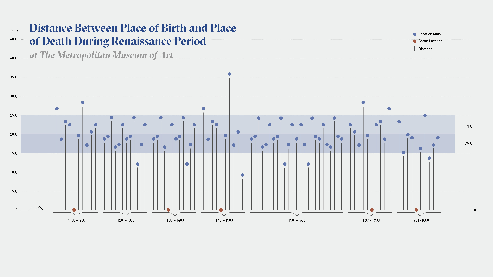

## Concept

For this quantitative data project, I want to explore the pattern formed by artists' life spans and their artworks which are intertwined with time. This project aims to visualize the correlation from a relatively macro perspective.

## Design Mockup

## Visual Inspiration& Mood board

If we compare the MET museum to a breathing organism, artists are similar to its DNA which carrying genetic instructions for function and growth. Inspiration of the visual forms came from Gel Electrophoresis, it is used as a diagnostic tool to visualize the fragments. Using electrophoresis, we can see how many different DNA fragments are present in a sample and how large they are relative to one another. Instead of imitating DNA shape, I took the abstract from and its transparency feature, applied with the MET data. 

A well-defined “line” of DNA on a gel is called a band. Each band contains a large number of DNA fragments of the same size that have all traveled as a group to the same position. In this visualization I adopted the ‘band’ shape to mark each year of the artwork.
.jpg)

## Preliminary Sketches

