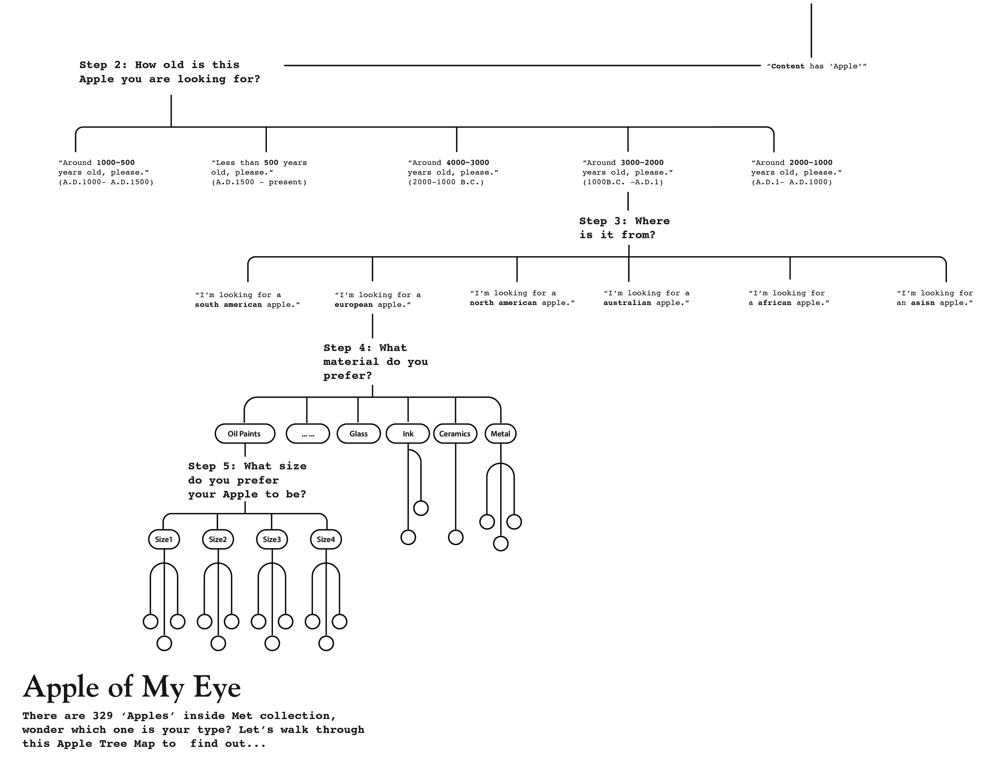

## Concept 1 “Apple of My Eye”

**Inspiration & Concept:**
Apples appear in many religious traditions, often as a mystical or forbidden fruit.  ( In greek mythology, to throw an apple at someone was to symbolically declare one's love; and similarly, to catch it was to symbolically show one's acceptance of that love. ) Renaissance painters may also have been influenced by the story of the golden apples in the Garden of Hesperides. As a result, in the story of Adam and Eve, the apple became a symbol for knowledge, immortality, temptation, the fall of man into sin, and sin itself.

Art was often utilized as a mirror to reflect our culture, there are 205 identified “Apples” in Met, were they used to embody the symbolic meaning as well? I also envision this can be further developed into an interactive piece, user can go through multiple categorize choices and discover one “Apple” read more about it.

**Main purpose:** 
 - Do these 205 apples have symbolic meanings?
 - How can they be categorized?  
 - Is there any intertwine relations between them (across different time period & region)? Inviting people to explore Met’s vast and less well-known collection in a more recreational way. 
 - After going through multiple choices, hopefully everyone will find the Apple of their eyes in Met collection.

**Chart References:**
*Tree Diagram / Decision Tree / Information Mapping*

## Concept 2 “Portray Portraits”

**Inspiration & Concept:**
Sir Peter Paul Ruben was a Flemish artist. He is considered the most influential artist of Flemish Baroque tradition. Rubens's highly charged compositions reference erudite aspects of classical and Christian history. His unique and immensely popular Baroque style emphasized movement, color, and sensuality, which followed the immediate, dramatic artistic style promoted in the Counter-Reformation. Rubens specialized in making altarpieces, portraits, landscapes, and history paintings of mythological and allegorical subjects.

How often do we use the same set of adjectives and nouns to describe artworks from the same artist? If some of them have higher frequency to appear in the description, can we use those to summarize the artist’s general style? Compare across different references resources, how do those adjectives and nouns relate with each other, how similar are the description to each other?

**Main purpose:** 

 - Explore how often we use the same set of adjectives and nouns to describe artworks from the same artists  ( In this project, it’s Peter Paul Ruben) 
 - Compare the similarity of describing the same artist across different references resources.

**Chart References:**
*Word Mapping / Genealogy Map*

## Concept 3 DIY Search

**Inspiration & Concept:**
Brewster & Company, established in 1810 in New Haven, specialized in the manufacture of fine carriages.  The founder opened a New York showroom in 1827 at 53-54 Broad Street. Of all American carriage manufacturers, none was as highly regarded for design, finish and quality as Brewster & Company. The drawings are on a variety of different paper types and vary greatly in size. 

Because these drawing were initially served as design plans,  almost like a catalog for products, in order to assist people to browse through these exquisite drawings easily, I want to design a DIY search ‘tool’. Similar to any shopping website, displayed search results are narrowed down based on people’s choices. Photos of drawings are grouped and categorized accordingly.

**Main purpose:** 

 - Want to adopt the user flow of online shopping to design a customized search tool which might help to improve people’s searching journey more easily and intuitively. 

**Chart References:**
*Isotype maybe?*

