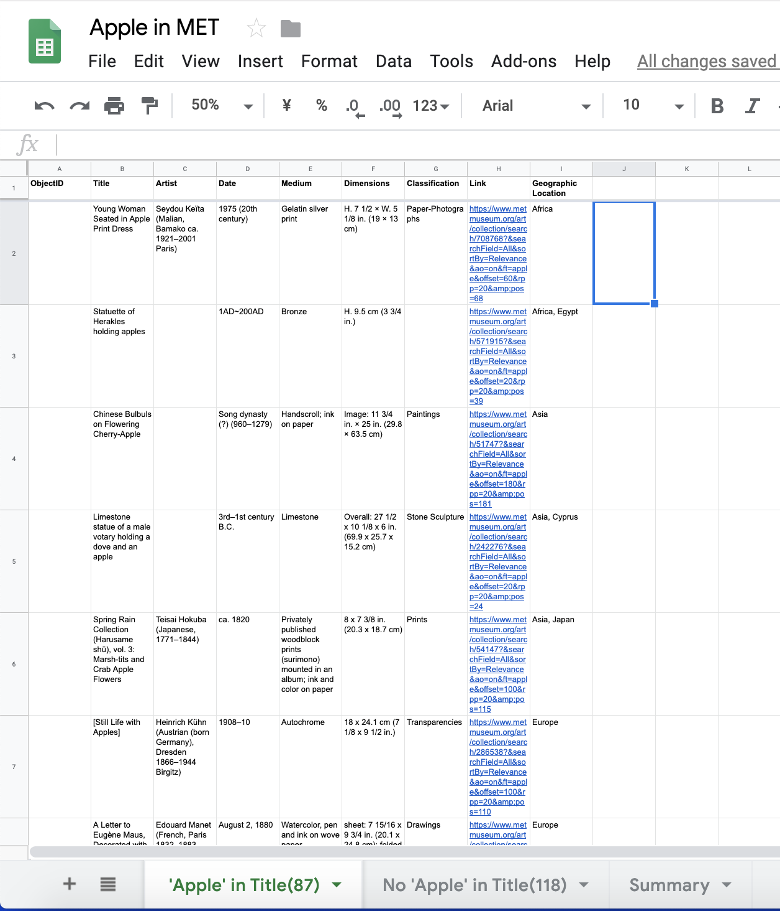
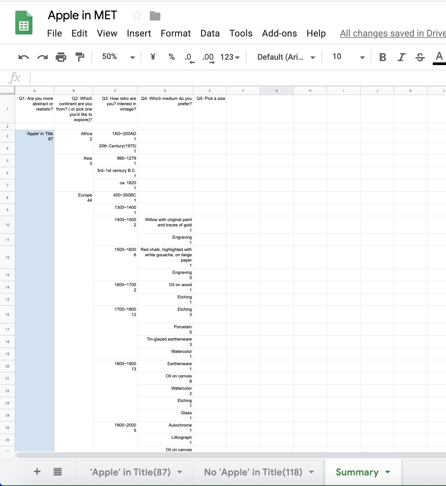
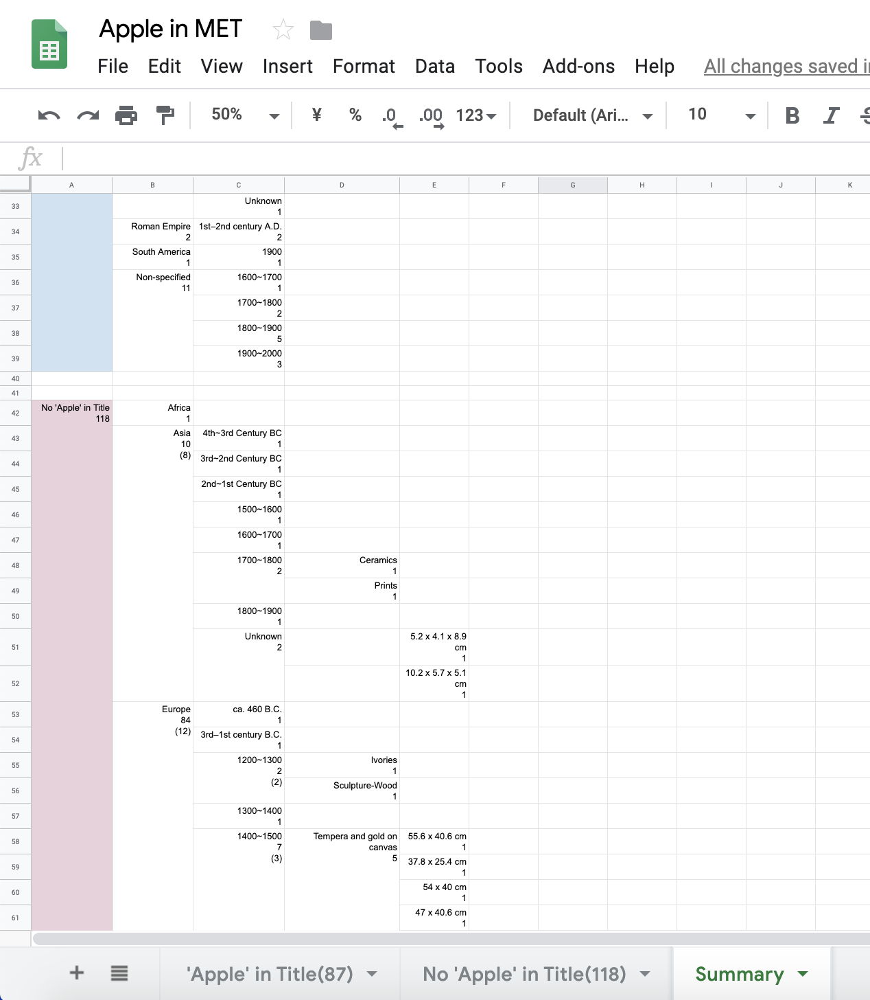
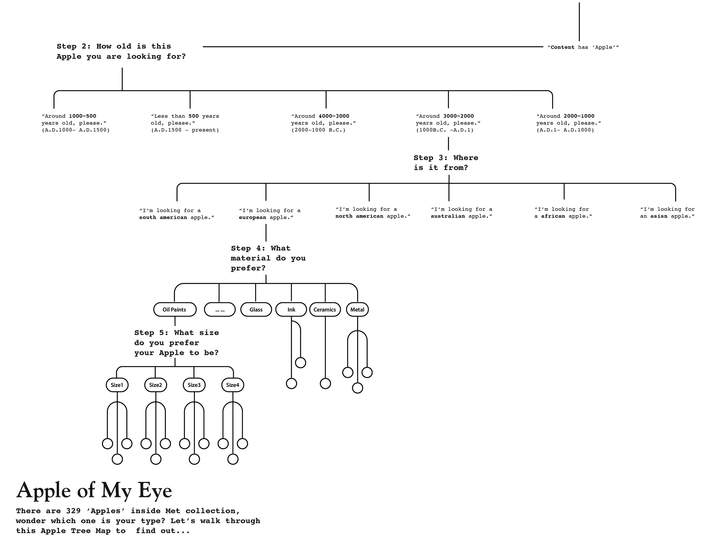

# “Apple of My Eye”

## Inspiration
Art has often being utilized as a mirror to reflect our history, it’s a pair of lenses which enable us to look deepen into our culture to see what was popular around which time period, also help us questioning why?

It’s interesting to see there are 205 identified “Apples” in Met, they are neither made by well-known artists nor possesses a significant position in art history, but they are very diverse in terms of using media and formatting. Were they being used to embody the symbolic meaning as well?

***About Apple:***
Apples appear in many religious traditions, often as a mystical or forbidden fruit.  ( In greek mythology, to throw an apple at someone was to symbolically declare one's love; and similarly, to catch it was to symbolically show one's acceptance of that love. ) Renaissance painters may also have been influenced by the story of the golden apples in the Garden of Hesperides. As a result, in the story of Adam and Eve, the apple became a symbol for knowledge, immortality, temptation, the fall of man into sin, and sin itself.

## Design Concept
Through this quantitative project, I want map out all identified apples inside Met Collection based on their interlaced relations ( geographic, medium, size...). Using tree diagrams and flow chats’ structure to build/link the contents.

***Main purpose:*** 

 - How can these 205 "Apples" be categorized?  
 - Do artists just pick apple as a random fruit to depict in their artworks or is it highly associated with embedded cultural significance?
 - Within Met’s collection, which continent uses apple as a metaphor more than others? And which media is more popular being used to depict apples?
 - Inviting audience to explore Met’s vast and less well-known collection in a more recreational way. ( Hopefully after going through multiple choices, everyone will find the "Apple of Their Eyes" in Met collection.)

**Chart References:**

*Tree Diagram / Decision Tree / Flow Chart*

***Format:***

*Poster & Foldable Map*

Also adopting the method of a kid’s play book (usually you would find in children’s reading section) to invite the audience to explore these artworks recreationally. Hopefully by end of the experience, audience would discover one Apple they never known before.

*I went to several bookstore to look for references about physical play books.*

## Data Sorting
I parsed out the "Apples" data from Met API, cleaned and reorganized the data in a way which is ready to be sorted into categories. Using excel to map out all the "nodes" in each tree branch.

## Layout Iterations
*Design from last week:*

*Layout Iterations:*

## Preliminary Sketch

## Next Steps

 - Finish the Apple Tree mapping, finalize the design style and details.
 - Carefully rethink about how to present all the artworks in a separate
   poster. 
 - Plan and think about how to implement this concept as a digital piece for the  interactive project.