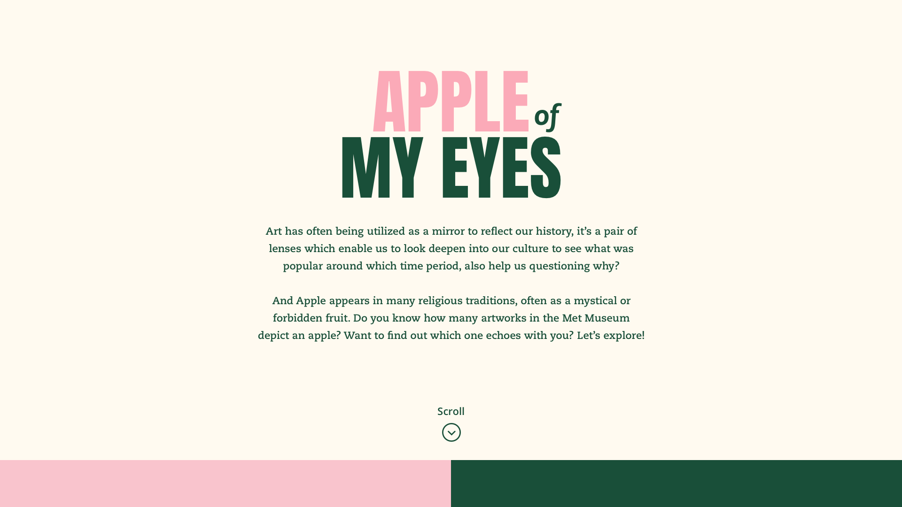
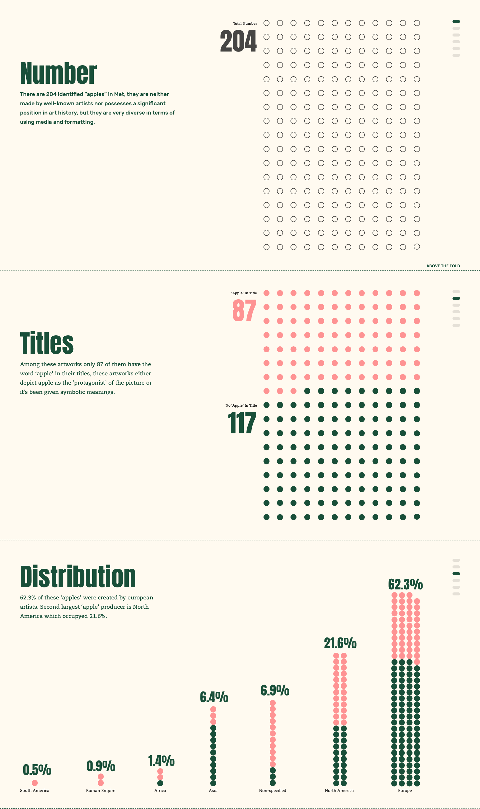

# “Apple of My Eye” II

## Concept

As an interactive counter piece for the printed apple map, this interactive data visualization provides audience with both choices: a narrative or an interactive journey. "Scrolling is a continuation, clicking is a decision." Through this piece audience can either choose a summary of the apples in Met (if they only have couple of minutes) to view all the quantitative statistics and facts, or choose an exploration journey (if they are willing to spend more time) to dive into Met apples' qualitative data and select the one, view more details in Met's online website.

## Inspiration & References
[Pudding(narrative)](https://pudding.cool/2017/03/hamilton/)
[Scrolling(narrative)](http://vallandingham.me/scroll_demo/)
[Trust(interactive)](https://ncase.me/trust/)

## Sketches

